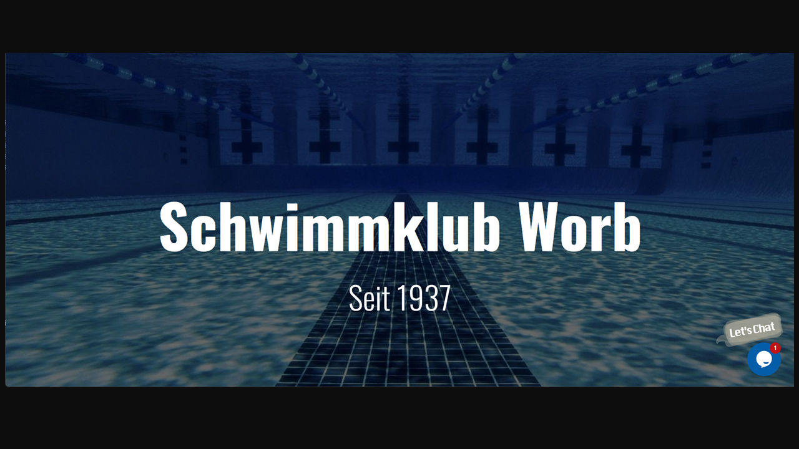

###

<h2 align="center">My Stats</h2>

###

[

###

<h2 align="center">Techs I Use</h2>

  
### :books: I'm currently learning
  
  
  
  
  
  
  
  
  
  

### :file_folder: Learned technologies
  
    
  
  
  
  
  
  

###

<h2 align="center">Projects</h2>

###

  <h3>
    Schwimmklub Worb
  </h3>
  
  
  
  https://skworb.ch

  <h3>
    Helfen helfen Schweiz
  </h3>
  
  
  
  https://www.helfen-helfen.swiss

